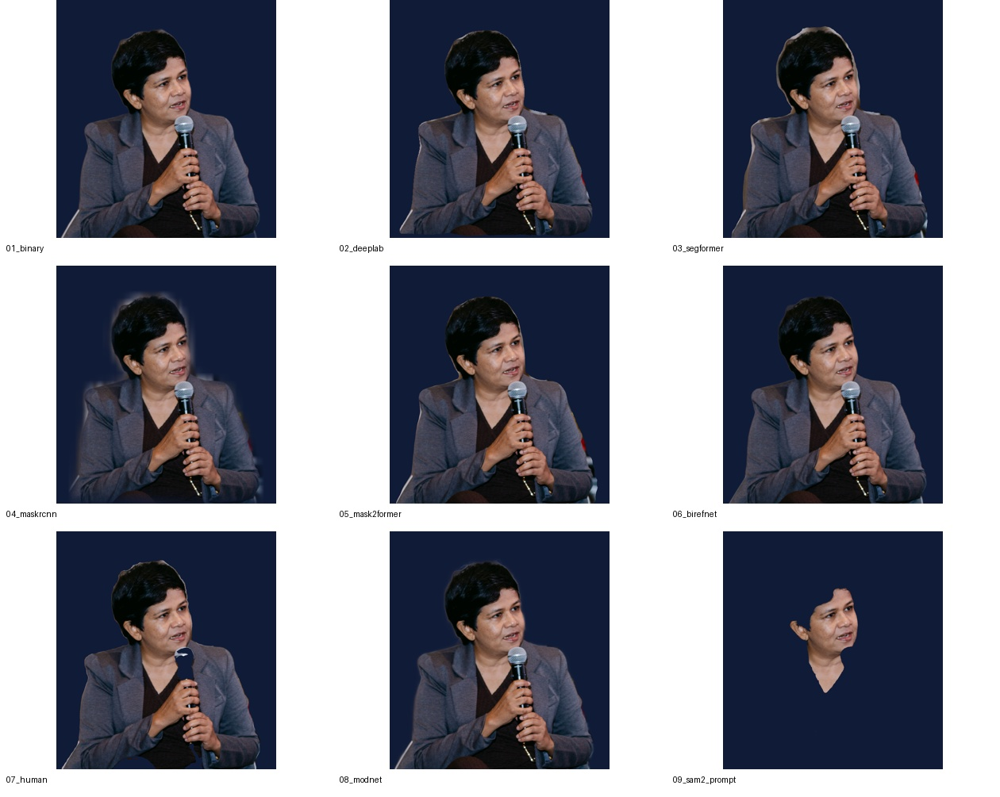
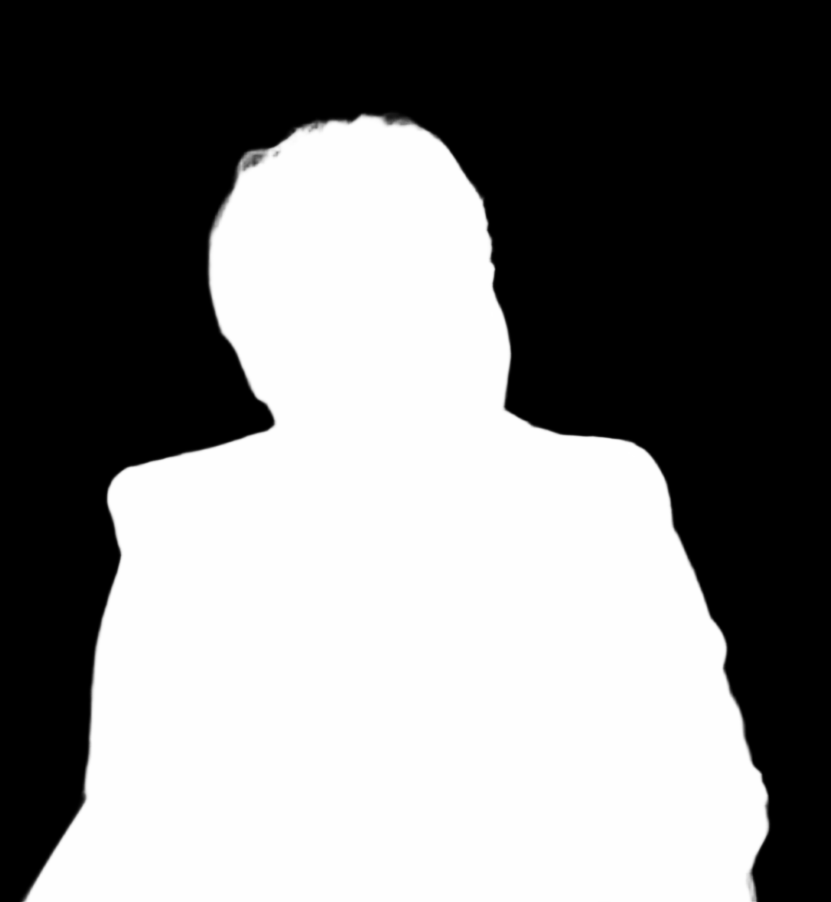

# Segmentation Model Lab

**Exploring subject extraction for automated photo editing.**

This research prototype compares ten pretrained segmentation and matting approaches through a shared photography workflow: extract a subject, save its mask and transparent cutout, and composite it onto a navy studio background. It also explores how segmentation can support selective photo effects.

The repository contains inference adapters, saved qualitative results, a colour-subject / monochrome background effect, and an experimental XMP preset renderer. It does not train a new model.

[Results](#qualitative-results) · [Models](#model-approaches) · [Run locally](#run-locally) · [Experiments](#photo-editing-experiments) · [Limitations](#limitations-and-next-steps)

## Research question

How do different definitions of foreground—person class, object instance, salient object, human body parts, alpha matte, and prompted region—affect a photographic cutout?

The practical focus is on hair and clothing boundaries, retained accessories, background leakage, and whether the extracted subject remains useful for downstream editing. The shared composite makes these differences easier to inspect.

## Qualitative results

The saved comparison below contains **nine model outputs**. A tenth adapter, SAM 2 automatic segmentation, is implemented but has no saved result in this snapshot.



_Left to right, top to bottom: U²-Net, DeepLabV3, SegFormer, Mask R-CNN, Mask2Former, BiRefNet, human parser, MODNet, and point-prompted SAM 2.1. These are saved exploratory results, not a scored benchmark._

### Inspect the input and intermediate outputs

|           Input photograph           |                       BiRefNet mask                       |                  BiRefNet studio composite                   |
| :----------------------------------: | :-------------------------------------------------------: | :----------------------------------------------------------: |
|  |  |  |

The [complete output folders](segmentation-for-photo-editing/outputs/) also contain transparent cutouts, individual person masks, human-part visualizations, and the MODNet alpha matte.

### What this example illustrates

- The saved point-prompted SAM result isolates a face region. A foreground point does not necessarily specify the entire person; prompt placement and mask selection matter.
- Human parsing can exclude accessories such as the microphone because its foreground is defined by human-part labels.
- The Mask R-CNN and MODNet composites show visible soft regions around parts of the outline. Inspect the full-resolution masks and alpha mattes when assessing boundary quality.

These observations describe this example only. No aggregate ranking, ground-truth accuracy, or runtime comparison is established here.

## Model approaches

| ID  | Approach                     | Implementation / checkpoint                                              | Foreground selection                                                             |
| --- | ---------------------------- | ------------------------------------------------------------------------ | -------------------------------------------------------------------------------- |
| 1   | Binary foreground extraction | U²-Net through `rembg` (`u2net`)                                         | Predicted foreground alpha                                                       |
| 2   | Semantic segmentation        | TorchVision DeepLabV3–ResNet50, default weights                          | `person` class                                                                   |
| 3   | Semantic segmentation        | `nvidia/segformer-b0-finetuned-ade-512-512`                              | `person` class                                                                   |
| 4   | Instance segmentation        | TorchVision Mask R-CNN ResNet50 FPN v2, default weights                  | Person instances with confidence ≥ 0.5; merged by pixelwise maximum              |
| 5   | Panoptic segmentation        | `facebook/mask2former-swin-small-coco-panoptic`                          | Segments labelled `person`                                                       |
| 6   | Salient-object extraction    | `ZhengPeng7/BiRefNet`                                                    | Predicted foreground                                                             |
| 7   | Human parsing                | `fashn-ai/fashn-human-parser`                                            | Union of non-background part labels                                              |
| 8   | Portrait matting             | `DavG25/modnet-pretrained-models`, photographic portrait ONNX checkpoint | Continuous alpha matte                                                           |
| 9   | Promptable segmentation      | `facebook/sam2.1-hiera-small`                                            | Highest-scoring mask for one positive point                                      |
| 10  | Automatic segmentation       | `facebook/sam2.1-hiera-small`                                            | Top 30 masks saved separately; union of all segments larger than 1% of the image |

Model 10 can include background regions: its union is not a person-specific cutout. The unused `src/07_human_schp.py` is an integration placeholder, not an additional working model.

## Run locally

The runnable project lives in the `segmentation-for-photo-editing/` folder. After cloning or downloading this repository, open a terminal at the repository root and enter that folder first. Run all remaining model and editing commands from inside it. Use Python 3.11 for the documented setup. Dependencies are specified as minimum versions, not a locked environment.

```bash
# From the repository root, enter the runnable project folder
cd segmentation-for-photo-editing

python -m venv .venv
source .venv/bin/activate
# Windows PowerShell: .venv\Scripts\Activate.ps1
python -m pip install -r requirements.txt

# Start with one model and the included example
python run_all.py --only 6 --image input/photo.jpg
```

First use downloads pretrained weights. PyTorch adapters select CUDA, then Apple MPS, then CPU. MODNet uses ONNX Runtime with CUDA when its provider is available, otherwise CPU. BiRefNet loads its checkpoint's custom model code with `trust_remote_code=True`.

```bash
# Select several approaches
python run_all.py --only 1,2,3,4,5,6,7,8

# Use another photograph
python run_all.py --only 6 --image path/to/photo.jpg

# Attempt all ten adapters
python run_all.py

# Rebuild the contact sheet from existing outputs (no model inference)
python compare.py --root outputs
```

Each adapter runs independently; failures are printed and the remaining models continue. Check the console for `[failed]` messages: the runner can finish even when individual models fail.

### Optional SAM 2 installation

The SAM adapters require Meta's separate `sam2` package.

```bash
git clone https://github.com/facebookresearch/sam2.git external/sam2
python -m pip install -e ./external/sam2
python run_all.py --only 9 --sam-point 0.5,0.45
```

`--sam-point` is a normalized `x,y` foreground point relative to image width and height. Both SAM adapters download the small SAM 2.1 checkpoint and use the configuration bundled with the installed package.

### Output files

| File                                        | Meaning                                                              |
| ------------------------------------------- | -------------------------------------------------------------------- |
| `mask.png`                                  | Foreground mask; dimensions follow the adapter's prediction pipeline |
| `alpha.png`                                 | MODNet's continuous alpha matte                                      |
| `cutout.png`                                | Transparent RGBA foreground at input resolution                      |
| `studio.jpg`                                | Foreground over RGB `(16, 27, 55)`                                   |
| `person_01_*`                               | Mask R-CNN per-person results                                        |
| `human_parts.png` / `panoptic_segments.png` | Colour-coded part / segment IDs, not confidence maps                 |
| `scores.txt`                                | SAM candidate scores, not benchmark accuracy                         |
| `comparison/comparison.jpg`                 | Contact sheet of available outputs                                   |

**Output folders are reused.** A partial or failed run can leave old images in place, and the comparison script includes every available model folder. For a new experiment, move the existing `outputs/` directory to a separate location first so different inputs cannot be mixed. Re-running on the same paths replaces files.

## Photo-editing experiments

### Colour subject with a monochrome streak background

The effect uses a BiRefNet mask to preserve the subject's colour while converting and directionally blurring the background. Blur samples exclude foreground pixels to limit subject streaks.


```bash
python -m pip install -r color_subject_streak/requirements.txt
python color_subject_streak/run_effect.py --image input/photo.jpg --blur 0.08 --angle -25
```

An existing mask can be supplied with `--mask` to tune the effect without repeating inference. See the [effect guide](segmentation-for-photo-editing/color_subject_streak/README.md) for options, supported formats, and tests.

### XMP preset rendering

A separate experiment interprets XMP settings using Python image operations. It explores approximate preset rendering; it does not reproduce Adobe Lightroom's processing engine.

The Lightroom presets used for the saved examples were created by the project author and are kept private. Their XMP files are excluded from this repository; the renderer and example result images are shared. To run the experiment, supply your own exported Lightroom XMP preset.


See the [preset guide](segmentation-for-photo-editing/preset_testing/README.md) for commands and scope. This is a separate editing example, not a segmentation benchmark result.

## Repository layout

```text
repository-root/
├── README.md
├── LICENSE
├── docs/
│   └── REPRODUCIBILITY.md
└── segmentation-for-photo-editing/   # Open this folder to run the project
    ├── run_all.py                    # Model selection and execution
    ├── compare.py                    # Contact sheet from existing outputs
    ├── run.sh / run.bat              # Convenience launchers
    ├── requirements.txt
    ├── src/                          # Model adapters and shared utilities
    ├── input/                        # Example photographs
    ├── outputs/                      # Saved masks, cutouts, and comparisons
    ├── color_subject_streak/         # Selective colour effect
    └── preset_testing/               # XMP renderer; private presets excluded
```

## Limitations and next steps

This is a qualitative feasibility study using pretrained models with different objectives. The saved results are not accompanied by ground-truth masks, a dataset-wide evaluation, timings, a hardware log, or pinned checkpoint revisions. They should not be interpreted as evidence that one approach is universally best.

A more rigorous follow-up would use a documented image set and manual reference masks, measure segmentation overlap and boundary quality, evaluate matting separately, and record latency and memory on fixed hardware. Prompted methods should also record prompt coordinates and selection rules. See [reproducibility notes](docs/REPRODUCIBILITY.md).

## License

The original code and documentation in this repository are available under the [MIT License](LICENSE).

The author's Lightroom presets are private, are not distributed here, and are not licensed under MIT. Displaying their result images does not grant a license to the preset files.

Pretrained models, downloaded packages, photographs, presets, and image assets are not covered by this code license and retain their respective ownership and terms. Generated examples do not grant additional rights to the underlying photographs. No model weights are bundled.
